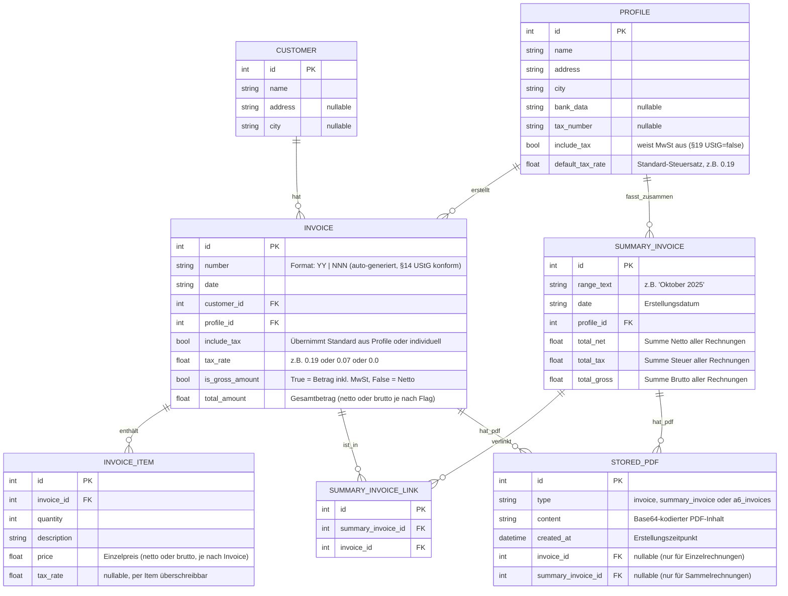

# ✂️ Invoice Tool für Kleinunternehmer 

<!-- Core badges -->
[](https://github.com/wontknow/Billino/releases/latest/download/Billino.Setup.2.0.0.exe)
[](https://github.com/wontknow/Billino/actions)
[](https://github.com/wontknow/Billino/actions)
[](https://codecov.io/gh/wontknow/Billino)
[](https://www.gnu.org/licenses/agpl-3.0)
[](https://github.com/wontknow/Billino/releases)
[](https://github.com/wontknow/Billino/commits/main)

<!-- Docs & Tech -->
[](https://github.com/wontknow/Billino/wiki)


<!-- Repo activity -->


<!-- Optional (commented) -->
<!--  -->
<!--  -->
<!--  -->
<!--  -->
<!--  -->

<!-- Future (commented) -->
<!-- [](https://stats.uptimerobot.com/xxxxxxx) -->
<!-- [](https://github.com/wontknow/Billino/releases) -->


Ein over-engineered **offlinefähiges Rechnungsprogramm** mit klarer FE/BE-Trennung – entwickelt für den Einsatz ohne Cloud, aber mit Möglichkeit zur späteren Erweiterung (Hosting, Multi-User, Cloud-Sync).


---

## ✨ Features

### ✅ Implementiert (v1.0.0 – v2.0.0)

#### Core Features (v1.0.0 MVP)
- **Kundenverwaltung**: CRUD API für Stammkunden (Name, Adresse, Stadt)
- **Profile**: Absender-Profile mit flexiblen Steuereinstellungen
  - 19% MwSt (Standard), 7% MwSt (ermäßigt), 0% MwSt (§19 UStG)
  - Automatische Vererbung oder individuelle Überschreibung pro Rechnung
- **Rechnungserstellung**: Vollständige API mit erweiterten Funktionen
  - **Automatische Rechnungsnummern**: `YY | NNN` Format (z.B. "25 | 001")
  - **§14 UStG konform**: Fortlaufende, lückenlose Nummerierung über alle Profile
  - **Frontend-freundlich**: Nummer-Preview ohne DB-Änderung
  - **Format-Validierung**: Regex-basierte Eingabe-Überprüfung
  - Flexible Steuerkonfiguration (Brutto/Netto-Eingabe)
  - Mehrere Rechnungspositionen pro Rechnung
  - Validierung und Summenprüfung
- **Sammelrechnungen**: Monats-/Jahres-Abrechnungen mit Steuerberechnung
  - Automatische Aggregation von Einzelrechnungen
  - Separate Steuerausweise nach Steuersätzen
- **PDF-Generierung**: Professionelle PDF-Erstellung mit modernem Design
  - **A4-Format**: Einzelrechnungen und Sammelrechnungen
  - **A6-Format**: 4×A6-Rechnungen auf A4-Seiten (2×2 Grid mit Schnittmarken)
  - Elegante Farbpalette (Dark Charcoal, Medium/Light Gray)
  - Moderne Typografie mit hierarchischen Font-Größen
  - ReportLab-basierte PDF-Engine für alle Formate
- **PDF CRUD**: Vollständige API für PDF-Speicherung und -Verwaltung
  - PDF-Erstellung für Rechnungen und Sammelrechnungen (A4)
  - PDF-Erstellung für A6-Layouts (4 Rechnungen pro A4-Seite)
  - Base64-Speicherung in SQLite Database
  - CRUD-Operationen: Erstellen, Abrufen, Listen, Löschen
  - RESTful API mit strukturierter Fehlerbehandlung
- **Database**: SQLite mit Foreign Key-Constraints und Relationen
- **API**: RESTful FastAPI mit OpenAPI/Swagger-Dokumentation
- **Invoice-Form Frontend**: Vollständige Rechnungserstellung im Browser
  - ✨ Customer-Suche mit Autocomplete & Dropdown
  - ✨ Dynamic Invoice-Items (Add/Remove bis max. 10)
  - ✨ Automatic Totals-Berechnung
  - ✨ Steuer-Toggle mit Steuersatz-Eingabe
  - ✨ Validierung mit Fehleranzeige
  - ✨ Professionelle UI-Alerts (grün/rot) mit Auto-Dismiss
  - ✨ Field-Level Error-Display
  - ✨ Comprehensive Form-Logging für Debugging
- **Strukturiertes Logging System**: Backend + Frontend
  - 🔍 ENV-aware Logging (DEBUG in Dev, INFO in Prod)
  - 🎨 Scoped Logger mit Emoji-Präfixen für bessere Lesbarkeit
  - 📊 Alle Services & Endpoints instrumentiert
- **Error Handling & Parsing**: Professionelle Error-Verarbeitung
  - 🔧 FastAPI Validation-Error Parser
  - 📋 Field-Level Error-Details im Frontend
  - 🎯 Structured Error Messages

#### Features (v1.1.0)
- **PDF Viewer Integration**: Frontend-Integration zum Anzeigen generierter PDFs
  - 📄 PDF-Anzeige direkt im Browser
  - 🔍 Zoom & Navigation
  - 📥 Download & Drucken
- **Customer Management UI**: Vollständige Frontend-Verwaltung für Kunden
  - ✏️ Create/Edit UI für Kunden
  - 📝 Customer-Notizen hinzufügen
  - 💾 Persistierung in SQLite
- **Profile Management UI**: Vollständige Frontend-Verwaltung für Profile
  - ✏️ Create/Edit UI für Profile
  - 🎯 Flexible Steuereinstellungen per UI
  - 💾 Profile-Auswahl für Rechnungserstellung
- **Backup System**: Basis-Backup-Funktionalität für Datensicherung
  - 📅 Zeitgestempelte Backups
  - ♻️ Automatische Backup-Rotation
  - 📦 Backup-Wiederherstellung

#### Neue Features (v1.2.0)
- **Komplexe Filter & Sortierung**: Sortieren und Filtern der Tabellen nach ausgewählten Spalten

#### Neue Features (v2.0.0)
- **Desktop-App (Electron)**: Vollständige Desktop-Version als Windows-Installer
  - 🖥️ Electron bündelt Backend + Frontend + SQLite in **eine Setup-Datei**
  - 🚀 PyInstaller-gebundeltes FastAPI-Backend startet automatisch
  - 📂 Daten in `%APPDATA%/Billino` (DB, Backups, PDFs, Logs)
  - 💾 Automatisches Backup bei jedem App-Schließen
  - 🔒 Offline-fähig – keine Internetverbindung nötig
  - 📦 NSIS-Installer mit Deinstallation über Windows-Einstellungen
  - 🔄 Custom `app://` Protocol für SPA-Routing im Static Export
  - 📊 Renderer-Logging in electron-log für Debugging


### 🚧 Geplant
- E-Rechnung (XRechnung / ZUGFeRD)
- Datenexport (CSV/XLSX)
- Cloud-Sync & Multi-Device

### 📦 Version History
- **v2.0.0** ✅ (Februar 2026): Desktop-App mit Electron + PyInstaller-Bundle
- **v1.2.0** ✅ (Dezember 2025): Komplexe Filter und Sortierung der Tabellen
- **v1.1.0** ✅ (Dezember 2025): PDF Viewer, Customer Management, Profile Management, Backup System
- **v1.0.0** ✅ (November 2025): MVP Complete - Invoicing Core, Profile Management, PDF Generation

### 🎯 v2.0.0 Status: ✅ RELEASED (Februar 2026)
Alle **✅ Implementiert** Features = **Release Complete**. Alle neuen 🚧 Features = **Post-v2.0.0**.

---

## 🛠 Tech Stack
- **Frontend**: [Next.js 16](https://nextjs.org/docs/app) (App Router, Static Export), React 19, [shadcn/ui](https://ui.shadcn.com) (Radix UI + Tailwind), TypeScript (pnpm)
- **Backend**: [FastAPI](https://fastapi.tiangolo.com), [SQLite](https://sqlite.org), [ReportLab](https://www.reportlab.com/docs/reportlab-userguide.pdf) (PDF)
- **E-Rechnung**: XRechnung (KoSIT Specs), ZUGFeRD (PDF/A-3 + XML)
- **Desktop-App**: [Electron](https://www.electronjs.org/) mit Python-Backend (via [PyInstaller](https://pyinstaller.org/))

---

## 📂 Ordnerstruktur

```
backend/          # FastAPI, SQLite, Services
├── models/       # SQLModel Datenmodelle
├── routers/      # API Endpoints (customers, profiles, invoices, summary_invoices, pdfs)
├── services/     # Business Logic 
│   ├── invoice_number_generator.py    # Automatische Rechnungsnummern
│   ├── summary_invoice_generator.py   # Sammelrechnungs-Logic
│   ├── pdf_generator.py               # A4-PDF-Generierung
│   ├── pdf_a6_generator.py            # A6-PDF-Generierung (4×A6 auf A4)
│   ├── pdf_data_service.py            # PDF-Daten-Aufbereitung
│   └── pdf_data_structures.py         # PDF-Datenstrukturen
├── scripts/      # Demo & Debug Scripts für PDF-Entwicklung
├── tests/        # Unit- & Integrationstests (167 Tests, 88% Coverage)
├── database.py   # DB-Setup & Session-Management
├── main.py       # FastAPI App-Entry
└── requirements.txt

frontend/         # Next.js 16 + React 19 + shadcn/ui + Tailwind v4 (pnpm)
electron/         # Electron App-Shell, Desktop-Packaging
.github/          # CI/CD, Issue-Templates, PR-Template
README.md
```

### Frontend – Ordnerstruktur (Details)

```
frontend/
├── .env.local.example              # Beispiel-ENV (NEXT_PUBLIC_API_URL)
├── package.json                    # Scripts (dev, build, test, lint, typecheck)
├── pnpm-lock.yaml
├── next.config.ts
├── tsconfig.json
├── jest.config.cjs                 # Jest + RTL Setup (jsdom)
├── public/                         # Statische Assets
│   ├── file.svg / globe.svg / …
├── src/
│   ├── app/                        # Next.js App Router
│   │   ├── (shell)/                # Shell-Layout & Seiten
│   │   │   ├── layout.tsx
│   │   │   ├── page.tsx            # Shell-Startseite
│   │   │   ├── customers/
│   │   │   │   ├── page.tsx        # Dumb Page → rendert Controller
│   │   │   │   ├── loading.tsx     # Route-Skeleton
│   │   │   │   └── CustomersController.tsx  # Server-Komponente (Data-Orchestrierung)
│   │   │   ├── profiles/
│   │   │   │   └── page.tsx
│   │   │   └── invoices/
│   │   │       └── page.tsx
│   │   ├── favicon.ico
│   │   ├── globals.css
│   │   ├── layout.tsx
│   │   └── page.tsx
│   ├── components/                 # App-weite Komponenten
│   │   ├── header.tsx
│   │   ├── sidebar.tsx
│   │   └── ui/                     # shadcn/ui Bausteine (Radix + Tailwind)
│   │       ├── table.tsx
│   │       ├── card.tsx
│   │       ├── button.tsx
│   │       ├── input.tsx
│   │       ├── skeleton.tsx
│   │       └── …
│   ├── features/                   # Präsentations-Features
│   │   └── customers/
│   │       ├── CustomersTable.tsx          # UI (Presentational)
│   │       └── CustomersTable.test.tsx     # Jest + RTL Tests
│   ├── services/                   # Datenzugriff (API)
│   │   └── customers.ts                    # nutzt NEXT_PUBLIC_API_URL
│   ├── types/                      # Geteilte Typen
│   │   └── customer.ts
│   ├── test/                       # Test-Setup
│   │   ├── setup.ts                        # jest-dom
│   │   └── styleStub.js                    # CSS-Stub
│   └── lib/
│       └── utils.ts
└── README.md
```

Architektur-Notiz (SOLID):
- Service: `src/services/customers.ts` → API-Aufrufe
- Controller (Server-Komponente): `src/app/(shell)/customers/CustomersController.tsx` → Datenfluss/Fehlerbehandlung
- Präsentation: `src/features/customers/CustomersTable.tsx` → reine UI (Loading/Empty/Error durch Caption)

---

## ⚙️ Environment & CORS Setup

### Backend – Umgebungsvariablen (`.env`)

Die Datei `backend/.env` steuert die CORS- und Logging-Konfiguration:

```properties
# Environment & Logging
ENV=development              # oder: production
LOG_LEVEL=DEBUG              # oder: INFO (Production)

# CORS – Lokale Entwicklung
ALLOWED_ORIGINS=http://localhost:3000,http://192.168.2.116:3000

# Für Produktion (Deployment)
# ENV=production
# LOG_LEVEL=INFO
# ALLOWED_ORIGINS=https://app.billino.de
```

**Wichtig:**
- `ALLOWED_ORIGINS`: Komma-separierte Liste der erlaubten Frontend-Quellen
- `ENV=development` aktiviert DEBUG-Logging mit strukturierten Ausgaben
- `ENV=production` nutzt INFO-Level und Production-optimierte Logs

**CORS-Funktionalität:**
- Automatische Antwort auf Browser-Preflight-Requests (`OPTIONS`)
- Credentials (`withCredentials`) erlaubt
- Alle HTTP-Methoden und Header akzeptiert
- Test: `curl -H "Origin: http://localhost:3000" http://127.0.0.1:8000/health`

---

### Frontend – Umgebungsvariablen (`.env.local`)

Die Datei `frontend/.env.local` konfiguriert die Backend-API-URL:

```bash
# Environment
NODE_ENV=development

# API – Backend-Adresse
NEXT_PUBLIC_API_URL=http://127.0.0.1:8000
```

**Wichtig:**
- `NEXT_PUBLIC_*` Variablen werden zur Build-Zeit in den Frontend-Code eingebettet (Browser-sichtbar)
- Nur für öffentliche Konfiguration verwenden (keine Secrets!)
- Der API-Service nutzt diese Var automatisch in allen HTTP-Requests
- Fallback (hardcoded): `http://localhost:8000` falls nicht gesetzt

**Umgebungs-Übersteuerung:**
| Umgebung | NEXT_PUBLIC_API_URL |
|----------|---------------------|
| Local Dev | `http://127.0.0.1:8000` |
| Electron Desktop | `http://127.0.0.1:8000` (bundled backend) |
| Deployment | `https://api.billino.de` |

**API-Service-Integration:**
Alle Frontend-HTTP-Requests nutzen den zentralen `ApiClient` in `src/services/base.ts`:

```typescript
// src/services/base.ts
export class ApiClient {
  static baseUrl(): string {
    return process.env.NEXT_PUBLIC_API_URL || process.env.API_URL || "http://localhost:8000";
  }

  // Beispiel: Kundenabruf
  static async get<T>(path: string, init?: RequestInit): Promise<T> {
    const url = `${this.baseUrl()}${path}`;
    // ...
  }
}
```

---

## 🚀 Entwicklung

### ⚡ Umgebungskonfiguration validieren

Vor dem Start sollten alle Umgebungsvariablen überprüft werden:

**Backend:**
```bash
cd backend
python scripts/check_env.py         # Validiert backend/.env
```

**Frontend:**
```bash
cd frontend
pnpm check-env                      # Validiert frontend/.env.local
```

Beide Scripts prüfen auf:
- ✅ Erforderliche Variablen vorhanden
- ✅ Gültige Werte (z.B. `ENV=development` vs. `ENV=invalid`)
- ✅ Keine leeren Werte
- ✅ Hilfreiche Fehlermeldungen mit Defaults

---

### Backend (FastAPI)
```bash
cd backend
python -m venv .venv

# Windows
.\.venv\Scripts\activate
# Linux/Mac
source .venv/bin/activate

pip install -r requirements.txt
uvicorn main:app --reload --port 8000
```

**API-Endpunkte**: [http://127.0.0.1:8000/docs](http://127.0.0.1:8000/docs)
- `/health` - System-Status
- `/customers/` - Kundenverwaltung
- `/profiles/` - Profile mit Steuereinstellungen
- `/invoices/` - Rechnungserstellung und -verwaltung
- `/summary-invoices/` - Sammelrechnungen
- `/pdfs/` - PDF-Erstellung und -Verwaltung

---

### Frontend (Next.js + shadcn/ui)
```bash
cd frontend

# Installation (mit pnpm - empfohlen)
pnpm install

# Development Server
pnpm dev

# TypeScript Type-Checking
pnpm typecheck

# Linting
pnpm lint

# Code Formatting
pnpm format

# Production Build
pnpm build
```
Standard-URL: [http://localhost:3000](http://localhost:3000)

Frontend-Routen (Auszug):
- `/customers` – Kundenliste (Read-Only):
  - Sticky Header, Scroll nur in der Card (responsive Höhe)
  - Loading: Skeleton; Empty: „Keine Kunden gefunden“; Error: zweizeiliges Caption (inkl. „Backend nicht erreichbar“)

**Tech Stack Details**:
- Next.js 16.0.1 (App Router, Static Export konfiguriert)
- React 19.2.0
- TypeScript (Strict Mode)
- Tailwind CSS v4 mit PostCSS
- shadcn/ui Components (Button, Input, Form, Table, Dialog, Card, etc.)
  - Basiert auf Radix UI Primitives
  - New York Style
- Lucide React Icons
- ESLint + Prettier

**Installierte shadcn/ui Components**:
- Form Components: Button, Input, Label, Form, Select, Textarea
- Layout: Card, Sheet, Dialog
- Data Display: Table

---

### Desktop (Electron)
```bash
# Dev-Modus (Backend muss separat laufen)
cd electron
npm run dev

# Installer bauen (Frontend + Backend müssen vorher gebaut werden)
npm run dist:win
```

---

## 🧪 Tests

### Backend
- Framework: [pytest](https://docs.pytest.org/) + [httpx](https://www.python-httpx.org/) für API-Tests
- Coverage mit [pytest-cov](https://pytest-cov.readthedocs.io/)
- Tests liegen in `backend/tests/`
- **Umfassende Testabdeckung**:
  - CRUD-Operationen für alle Entitäten
  - **Rechnungsnummern-Generierung**: Format-Validierung, Sequenziell, Global
  - Steuerberechnung (Brutto/Netto, verschiedene Steuersätze)
  - Validierung und Fehlerbehandlung
  - Session-Management und Transaktionen
  - Sammelrechnungs-Logik
  - **PDF-Generierung**: A4 & A6-Formate
  - **Edge Cases**: Fehlerbehandlung, Datenkonsistenz

**Aktuelle Test-Suite**:
```bash
cd backend
pytest tests/test_customers.py               # Kundenverwaltung (7 Tests)
pytest tests/test_profiles.py                # Profile mit Steuereinstellungen (7 Tests)
pytest tests/test_invoices.py                # Rechnungs-CRUD (12 Tests)
pytest tests/test_invoice_number_*.py        # Automatische Nummern-Generierung (11 Tests)
pytest tests/test_invoice_tax_*.py           # Steuerlogik & Edge Cases (22 Tests)
pytest tests/test_invoice_create_validation.py # Validierung Edge Cases (18 Tests)
pytest tests/test_summary_*.py               # Sammelrechnungen (43 Tests)
pytest tests/test_pdf_*.py                   # PDF-Generierung & CRUD (37 Tests)
pytest --cov=. --cov-report=html             # Coverage-Report (88%)
```

### Frontend
- [Jest](https://jestjs.io/) + [React Testing Library](https://testing-library.com/docs/react-testing-library/intro/)
- Unit-Tests für Komponenten
- Integrationstests für Formulare (Invoice Form)

Beispiel:
```bash
cd frontend
pnpm test
```

---

## 🤖 CI/CD Pipeline (GitHub Actions)

Datei: `.github/workflows/ci.yml`

```yaml
name: CI

on:
  push:
    branches: [ main ]
  pull_request:

jobs:
  backend-tests:
    runs-on: ubuntu-latest
    defaults:
      run:
        working-directory: backend
    steps:
      - uses: actions/checkout@v4
      - name: Setup Python
        uses: actions/setup-python@v5
        with:
          python-version: '3.11'
      - run: pip install -r requirements.txt
      - run: pytest --cov=.

  frontend-tests:
    runs-on: ubuntu-latest
    defaults:
      run:
        working-directory: frontend
    steps:
      - uses: actions/checkout@v4
      - name: Setup Node.js
        uses: actions/setup-node@v4
        with:
          node-version: '20'
      - name: Setup pnpm
        uses: pnpm/action-setup@v3
        with:
          version: 9
      - run: pnpm install --frozen-lockfile
      - run: pnpm test
      - run: pnpm lint
      - run: pnpm typecheck
```

- Jeder Commit/PR auf `main` triggert die Pipeline  
- Badge oben zeigt Status: ✅ Passed / ❌ Failed

---

## 📑 Projektphasen (Roadmap)

**MVP v1.0.0 Phasen (November 2025):**
- [x] **Phase 0** – Repo-Bootstrap (Ordner, CI/CD, Readme, Templates) 🎯 MVP
- [x] **Phase 1** – Backend-Skeleton (FastAPI Healthcheck) 🎯 MVP
- [x] **Phase 2** – DB-Anbindung (SQLite via SQLModel) 🎯 MVP
- [x] **Phase 3** – Models + CRUD (Kunden, Profile) 🎯 MVP
- [x] **Phase 4** – Invoice-Core (Rechnung, Nummernlogik, Steuerberechnung) 🎯 MVP
- [x] **Phase 4.1** – Auto-Rechnungsnummern (§14 UStG konforme Generierung) 🎯 MVP
- [x] **Phase 4.5** – Summary Invoices (Sammelrechnungen mit Service-Layer) 🎯 MVP
- [x] **Phase 5** – PDF-Renderer (A4, professionelles Design) 🎯 MVP
- [x] **Phase 5.1** – PDF CRUD API (Erstellen, Speichern, Abrufen, Löschen) 🎯 MVP
- [x] **Phase 6** – PDF-Renderer (A6×4 auf A4 mit Schnittmarken) 🎯 MVP
- [x] **Phase 7** – Frontend Bootstrap (Next.js 16 + React 19 + shadcn/ui + Tailwind v4) 🎯 MVP
- [x] **Phase 8** – Invoice-Form ✨ (Autocomplete, Submit, Alerts, Logging, Bug-Fixes) 🎯 MVP
- [x] **Phase 8.1** – Logging & Error Handling ✨ (Strukturiertes Logging, Error Parser, UI Alerts) 🎯 MVP

**v1.1.0 Phasen (Dezember 2025):**
- [x] **Phase 9** – PDF-Viewer Integration (Frontend PDF-Anzeige mit Zoom & Navigation) ✅ v1.1.0
- [x] **Phase 10** – Customer Management UI (Create/Edit/Delete/Notes) ✅ v1.1.0
- [x] **Phase 11** – Profile Management UI (Create/Edit/Delete) ✅ v1.1.0
- [x] **Phase 12** – Backup System (Rotation, Restore) ✅ v1.1.0

**v1.2.0 Phasen (Dezember 2025):**
- [x] **Bugfix** - Bugfix Summary Invoice erstellung mit mehreren Profilen
- [x] **Feature** - Komplexe Filter und Sortierung der Tabellen

**v2.0.0 Phasen (Februar 2026):**
- [x] **Phase 13** – Electron Shell (Desktop App Bootstrap, Custom Protocol) ✅ v2.0.0
- [x] **Phase 14** – Backend Bundle (PyInstaller-Integration in Electron) ✅ v2.0.0
- [x] **Phase 14.1** – Desktop Lifecycle (Auto-Backup, Graceful Shutdown) ✅ v2.0.0
- [x] **Phase 14.2** – NSIS Installer (Windows Setup.exe) ✅ v2.0.0

**Post-v2.0.0 Phasen (zukünftig):**
- [ ] **Phase 15** – E-Invoice Foundations (XRechnung/ZUGFeRD Integration)
- [ ] **Phase 16** – Datenexport (CSV/XLSX)
- [ ] **Phase 17** – Cloud-Sync & Multi-Device
- [ ] **Phase 18** – Release & Production Deployment

---

## � A6-PDF-Feature (Neu)

**Professionelle A6-Rechnungen auf A4-Format**:
Das System kann mehrere Rechnungen im A6-Format (105×148mm) auf einer A4-Seite (210×297mm) im 2×2-Grid arrangieren. Ideal für:
- **Kosteneffizienter Druck**: 4 Rechnungen pro A4-Seite
- **Professionelle Präsentation**: Mit Schnittmarken für sauberes Trennen
- **Automatische Seitenverwaltung**: Bei mehr als 4 Rechnungen werden weitere A4-Seiten erstellt

### Technische Umsetzung
- **ReportLab Platypus Framework**: Frame-basiertes Layout-System
- **Präzise Positionierung**: Mathematisch zentrierte Anordnung mit automatischen Margins
- **Crop Marks**: Professionelle Schnittmarken in allen vier Ecken jeder A6-Position
- **Responsive Design**: A6-optimierte Schriftgrößen und kompakte Layouts
- **Konsistente Typografie**: Angepasste Font-Hierarchie für kleinere Formate

### API-Verwendung
```http
POST /pdfs/a6-invoices
Content-Type: application/json

[1, 2, 3, 4]  # Array von Invoice-IDs (1-n Rechnungen)
```

**Response**: StoredPDF-Objekt mit Base64-kodiertem PDF-Inhalt

### Layout-Details
- **A6-Dimensionen**: 105×148mm (ReportLab: 297.6×419.5 points)
- **A4-Layout**: 2×2 Grid mit automatischer Zentrierung
- **Margins**: Berechnet als `(A4_width - 2×A6_width) / 2` für perfekte Ausrichtung
- **Crop Marks**: 6mm Linien außerhalb der A6-Bereiche
- **Font-Sizes**: A6-optimiert (Titel: 16pt, Header: 10pt, Text: 8pt)

---

## �🔧 API-Features & Business Logic

### Automatische Rechnungsnummern (§14 UStG konform)
**Rechtliche Compliance für Deutschland:**
- **Fortlaufend & lückenlos**: Globale Nummerierung über alle Profile hinweg
- **Format**: "YY | NNN" (z.B. "25 | 001", "25 | 002", ...)
- **Validierung**: Regex-basierte Format-Überprüfung bei manueller Eingabe
- **Frontend-Integration**: Preview-API für bessere Benutzererfahrung

**API-Endpunkte:**
```http
GET /invoices/number-preview
→ {"preview_number": "25 | 047"}

POST /invoices/ 
{
  "date": "2025-10-20",
  "profile_id": 1,
  "customer_id": 1,
  "total_amount": 100.0,
  "invoice_items": [...]
}
→ {"number": "25 | 047", ...}  # Auto-generiert
```

### Steuerberechnung
Das System unterstützt die deutsche Steuergesetzgebung mit flexibler Konfiguration:

**Steuerarten**:
- **Kleinunternehmer (§19 UStG)**: 0% MwSt
- **Standard-MwSt**: 19%
- **Ermäßigte MwSt**: 7% (z.B. Kunstverkäufe, bestimmte Dienstleistungen)

**Eingabemodi**:
- **Brutto-Eingabe**: Betrag inkl. MwSt → Netto wird automatisch berechnet
- **Netto-Eingabe**: Betrag excl. MwSt → Brutto wird für PDF/Display berechnet

### Validierung & Konsistenz
- **Summenprüfung**: Einzelpositionen vs. Gesamtbetrag (Toleranz: ±1 Cent)
- **Foreign Key-Validierung**: Profile und Kunden müssen existieren
- **Steuer-Konsistenz**: Automatische Vererbung oder explizite Überschreibung
- **Datenintegrität**: SQLite mit Constraints und Transaktionen

### Sammelrechnungen (Summary Invoices)
Automatische Aggregation von Einzelrechnungen für:
- Monatliche/jährliche Abrechnungen
- Separate Steuerausweise nach Steuersätzen
- Korrekte Netto/Brutto/Steuer-Berechnungen
- Service-Layer mit komplexer Geschäftslogik

### PDF-System
**Professionelle PDF-Generierung** mit moderner Optik:
- **Elegantes Design**: Dark Charcoal Primary (#2D3748), Medium/Light Gray Akzente
- **Typografie**: Hierarchische Font-Größen (24pt Titel, 12pt Headers, 10pt Text)
- **Layout**: Strukturierte Tabellen, HRFlowable-Trennlinien, optimaler Weißraum
- **ReportLab Engine**: Robuste PDF-Generierung für alle Formate

**PDF-Formate:**
- **A4-Format**: Einzelrechnungen und Sammelrechnungen (Standard-Layout)
- **A6-Format**: 4×A6-Rechnungen auf A4-Seiten im 2×2-Grid mit Schnittmarken
- **Automatische Seitenumbrüche**: Bei mehr als 4 A6-Rechnungen
- **Crop Marks**: Professionelle Schnittmarken für A6-Layouts

**CRUD API für PDF-Management**:
```http
POST /pdfs/invoices/123          # A4-PDF für Einzelrechnung erstellen & speichern
POST /pdfs/summary-invoices/456  # A4-PDF für Sammelrechnung erstellen & speichern
POST /pdfs/a6-invoices           # A6-PDF (4 Rechnungen auf A4) erstellen
     {"invoice_ids": [1,2,3,4]}  # JSON Body mit Invoice-IDs
GET /pdfs/                       # Alle PDFs listen
GET /pdfs/789                    # Einzelne PDF abrufen (Base64)
DELETE /pdfs/789                 # PDF löschen
```

**Storage**: Base64-Encoding in SQLite für einfache Handhabung ohne Dateisystem-Dependencies

---

## ✅ Definition of Done (pro Feature)
- [ ] API-Endpoints funktionieren & Tests grün  
- [ ] UI-Komponenten nutzbar (shadcn/ui Components)  
- [ ] CI/CD Pipeline grün (Backend + Frontend Tests)  
- [ ] README/Docs aktualisiert  
- [ ] Keine Secrets im Code  
- [ ] Build mit `electron` lauffähig  
- [ ] PDF-Ausgabe geprüft  
- [ ] (optional) E-Rechnung validiert (Validator)  

---

## 🗄️ Datenbankschema

Das Backend nutzt **SQLite** mit [SQLModel](https://sqlmodel.tiangolo.com/).  
Aktuell sind die folgenden Tabellen und Relationen definiert:



### Beschreibung 

- **Customer**: Stammdaten der Kunden (1:n zu Invoices)
- **Profile**: Absender-Profile mit Steuereinstellungen (1:n zu Invoices & Summary Invoices)
- **Invoice**: Einzelrechnungen mit automatischer Nummerierung & flexibler Steuerbehandlung
- **InvoiceItem**: Positionen einer Rechnung mit individuellen Steuersätzen
- **SummaryInvoice**: Sammelrechnungen für Monats-/Jahres-Abrechnungen
- **SummaryInvoiceLink**: n:m-Beziehung zwischen Summary Invoice und einzelnen Rechnungen
- **StoredPDF**: Base64-gespeicherte PDFs mit Verknüpfung zu Rechnungen
  - Typ "invoice": A4-PDF für Einzelrechnung
  - Typ "summary_invoice": A4-PDF für Sammelrechnung  
  - Typ "a6_invoices": A6-PDF (4×A6 auf A4) für mehrere Rechnungen

### Rechnungsnummern-Logik (§14 UStG)
- **Format**: "YY | NNN" (z.B. "25 | 001", "25 | 002")
- **Globale Sequenz**: Fortlaufend über alle Profile hinweg
- **Automatisch**: Backend generiert, Frontend braucht keine Logik
- **Validierung**: Regex-Überprüfung bei manueller Eingabe

### Steuerlogik
- **§19 UStG (Kleinunternehmer)**: `include_tax=false`, `tax_rate=0.0`
- **Standard-MwSt**: `include_tax=true`, `tax_rate=0.19`
- **Ermäßigte MwSt**: `include_tax=true`, `tax_rate=0.07`
- **Brutto-Eingabe**: `is_gross_amount=true` → Netto wird berechnet
- **Netto-Eingabe**: `is_gross_amount=false` → Brutto wird berechnet

---

## 📈 Entwicklungsstand (Februar 2026)

### Aktuelle Metriken (v2.0.0)
- **Test-Suite**: 295+ Backend Tests + Frontend Tests (88% Coverage)
- **Codebase**: ~8.000+ Lines of Code (ohne Scripts/Generated)
- **API-Endpunkte**: 30+ RESTful Endpoints
- **Frontend-Features**: Backend-Core + Invoice-Form + Customer Management + Profile Management vollständig
- **Logging**: Strukturiertes Backend + Frontend Logging System
- **UI-Components**: 25+ shadcn/ui Components integriert

### Code-Quality (v2.0.0)
- **Umfassende Validierung**: Alle Eingaben werden validiert (Pydantic/SQLModel + Zod)
- **Error Handling**: Strukturierte HTTP-Fehlerantworten mit Field-Level Details
- **Type Safety**: Vollständig typisiert mit Python Type Hints + TypeScript
- **Documentation**: Auto-generierte OpenAPI/Swagger-Docs
- **CI/CD**: Automatisierte Tests bei jedem Commit/PR
- **Logging**: Structured Logging mit DEBUG/PROD-Modes für Debugging
- **Customer Management**: Komplette UI mit CRUD-Operationen & Notizen
- **PDF Integration**: PDF Viewer im Frontend mit Zoom & Navigation
- **Backup System**: Automatische Datenbank-Backups mit Rotation

### Release Status
- ✅ **v2.0.0 Current**: Februar 2026 (Desktop-App mit Electron + PyInstaller-Bundle)
- ✅ **v1.2.0**: Dezember 2025 (Komplexe Filter und Sortierung)
- ✅ **v1.1.0**: Dezember 2025 (PDF Viewer, Customer Management, Profiles, Backup)
- ✅ **v1.0.0 MVP**: November 2025 (Invoicing Core, PDF Generation)

### Nächste Schritte (v2.1.0+)
#### Release 2.1.0
1. **Datenexport**: CSV/XLSX Export für relevante Daten

#### Weitere Releases
1. **E-Invoice Support**: XRechnung/ZUGFeRD Integration
2. **Cloud-Sync**: Multi-Device Synchronisation
3. **Multi-User**: Grundlagen für Mehrbenutzer-Unterstützung

---

## 📚 Referenzen (Docs)

### Backend
- FastAPI: https://fastapi.tiangolo.com  
- SQLModel: https://sqlmodel.tiangolo.com  
- ReportLab Guide: https://www.reportlab.com/docs/reportlab-userguide.pdf  

### Frontend
- Next.js App Router: https://nextjs.org/docs/app  
- Next.js Static Export: https://nextjs.org/docs/app/guides/static-exports  
- shadcn/ui Components: https://ui.shadcn.com  
- Radix UI Primitives: https://www.radix-ui.com/primitives  
- Tailwind CSS v4: https://tailwindcss.com/docs  
- React 19 Docs: https://react.dev  

### Desktop & E-Invoice
- Electron Docs: https://www.electronjs.org/docs  
- electron-builder: https://www.electron.build/  
- PyInstaller: https://pyinstaller.org/  
- XRechnung (KoSIT FAQ): https://en.e-rechnung-bund.de/e-invoicing-faq/xrechnung/  
