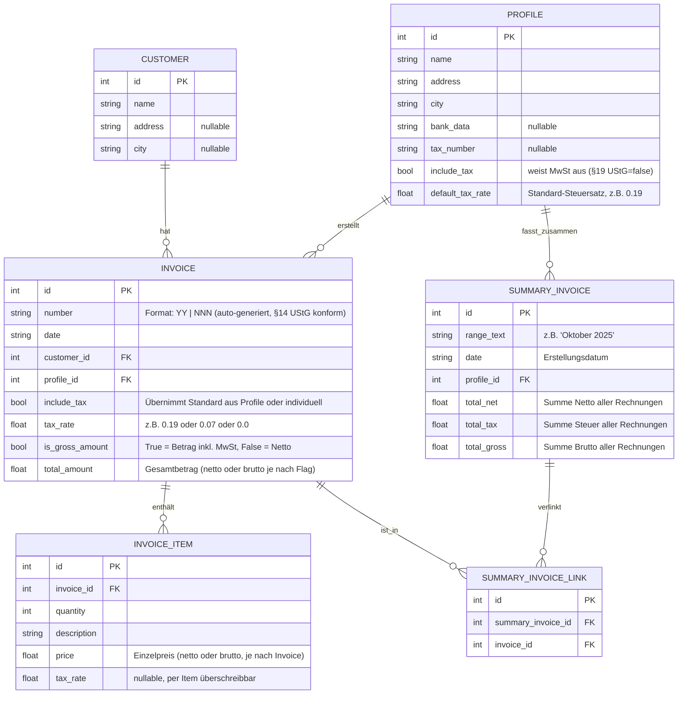

# ✂️ Invoice Tool für Kleinunternehmer 

<!-- Core badges -->
[](https://github.com/wontknow/Billino/actions)
[](https://codecov.io/gh/wontknow/Billino)
[](https://www.gnu.org/licenses/agpl-3.0)
[](https://github.com/wontknow/Billino/releases)
[](https://github.com/wontknow/Billino/commits/main)

<!-- Docs & Tech -->
[](https://github.com/wontknow/Billino/wiki)


<!-- Repo activity -->


<!-- Optional (commented) -->
<!--  -->
<!--  -->
<!--  -->
<!--  -->
<!--  -->

<!-- Future (commented) -->
<!-- [](https://stats.uptimerobot.com/xxxxxxx) -->
<!-- [](https://github.com/wontknow/Billino/releases) -->


Ein **offlinefähiges Rechnungsprogramm** mit klarer FE/BE-Trennung – entwickelt für den Einsatz ohne Cloud, aber mit professioneller Architektur und Möglichkeit zur späteren Erweiterung (Hosting, Multi-User, Cloud-Sync).

---

## ✨ Features

### ✅ Implementiert
- **Kundenverwaltung**: CRUD API für Stammkunden (Name, Adresse, Stadt)
- **Profile**: Absender-Profile mit flexiblen Steuereinstellungen
  - 19% MwSt (Standard), 7% MwSt (ermäßigt), 0% MwSt (§19 UStG)
  - Automatische Vererbung oder individuelle Überschreibung pro Rechnung
- **Rechnungserstellung**: Vollständige API mit erweiterten Funktionen
  - **Automatische Rechnungsnummern**: `YY | NNN` Format (z.B. "25 | 001")
  - **§14 UStG konform**: Fortlaufende, lückenlose Nummerierung über alle Profile
  - **Frontend-freundlich**: Nummer-Preview ohne DB-Änderung
  - **Format-Validierung**: Regex-basierte Eingabe-Überprüfung
  - Flexible Steuerkonfiguration (Brutto/Netto-Eingabe)
  - Mehrere Rechnungspositionen pro Rechnung
  - Validierung und Summenprüfung
- **Sammelrechnungen**: Monats-/Jahres-Abrechnungen mit Steuerberechnung
  - Automatische Aggregation von Einzelrechnungen
  - Separate Steuerausweise nach Steuersätzen
- **Database**: SQLite mit Foreign Key-Constraints und Relationen
- **API**: RESTful FastAPI mit OpenAPI/Swagger-Dokumentation

### 🚧 Geplant
- PDF-Erstellung (A4 Standard)
- PDF Layouts: A4 & 4×A6 auf A4
- E-Rechnung (XRechnung / ZUGFeRD)
- Frontend (Next.js + shadcn/ui)
- Desktop-App: Tauri v2 bündelt Backend + Frontend + DB in **eine ausführbare Datei**

---

## 🛠 Tech Stack
- **Frontend**: [Next.js](https://nextjs.org/docs/app) (App Router, Static Export), [shadcn/ui](https://ui.shadcn.com)
- **Backend**: [FastAPI](https://fastapi.tiangolo.com), [SQLite](https://sqlite.org), [ReportLab](https://www.reportlab.com/docs/reportlab-userguide.pdf) (PDF)
- **E-Rechnung**: XRechnung (KoSIT Specs), ZUGFeRD (PDF/A-3 + XML)
- **Desktop-App**: [Tauri v2](https://v2.tauri.app/) mit Python-Sidecar (via [PyInstaller](https://pyinstaller.org/))

---

## 📂 Ordnerstruktur

```
backend/          # FastAPI, SQLite, Services
├── models/       # SQLModel Datenmodelle
├── routers/      # API Endpoints (customers, profiles, invoices, summary_invoices)
├── services/     # Business Logic (invoice_number_generator, summary_invoice_generator)
├── tests/        # Unit- & Integrationstests
├── database.py   # DB-Setup & Session-Management
├── main.py       # FastAPI App-Entry
└── requirements.txt

frontend/         # Next.js + shadcn/ui (geplant)
src-tauri/        # Tauri App-Shell, Sidecar-Konfig
.github/          # CI/CD, Issue-Templates, PR-Template
README.md
```

---

## 🚀 Entwicklung

### Backend (FastAPI)
```bash
cd backend
python -m venv .venv

# Windows
.\.venv\Scripts\activate
# Linux/Mac
source .venv/bin/activate

pip install -r requirements.txt
uvicorn main:app --reload --port 8000
```

**API-Endpunkte**: [http://127.0.0.1:8000/docs](http://127.0.0.1:8000/docs)
- `/health` - System-Status
- `/customers/` - Kundenverwaltung
- `/profiles/` - Profile mit Steuereinstellungen
- `/invoices/` - Rechnungserstellung und -verwaltung
  - `GET /invoices/number-preview` - Vorschau der nächsten Rechnungsnummer
  - `POST /invoices/` - Neue Rechnung (Nummer wird automatisch generiert)
- `/summary-invoices/` - Sammelrechnungen

---

### Frontend (Next.js + shadcn/ui)
```bash
cd frontend
npm install
npm run dev
```
Standard-URL: [http://localhost:3000](http://localhost:3000)

---

### Desktop (Tauri v2)
```bash
cd src-tauri
cargo tauri dev
```

---

## 🧪 Tests

### Backend
- Framework: [pytest](https://docs.pytest.org/) + [httpx](https://www.python-httpx.org/) für API-Tests
- Coverage mit [pytest-cov](https://pytest-cov.readthedocs.io/)
- Tests liegen in `backend/tests/`
- **Umfassende Testabdeckung**:
  - CRUD-Operationen für alle Entitäten
  - **Rechnungsnummern-Generierung**: Format-Validierung, Sequenziell, Global
  - Steuerberechnung (Brutto/Netto, verschiedene Steuersätze)
  - Validierung und Fehlerbehandlung
  - Session-Management und Transaktionen
  - Sammelrechnungs-Logik

**Aktuelle Test-Suite**:
```bash
cd backend
pytest tests/test_customers.py               # Kundenverwaltung
pytest tests/test_profiles.py                # Profile mit Steuereinstellungen
pytest tests/test_invoices.py                # Rechnungs-CRUD
pytest tests/test_invoice_number_*.py        # Automatische Nummern-Generierung
pytest tests/test_invoice_tax_*.py           # Steuerlogik & Edge Cases
pytest tests/test_summary_*.py               # Sammelrechnungen
pytest --cov=. --cov-report=html             # Coverage-Report
```

### Frontend
- [Jest](https://jestjs.io/) + [React Testing Library](https://testing-library.com/docs/react-testing-library/intro/)
- Unit-Tests für Komponenten
- Integrationstests für Formulare (Invoice Form)

Beispiel:
```bash
cd frontend
npm run test
```

---

## 🤖 CI/CD Pipeline (GitHub Actions)

Datei: `.github/workflows/ci.yml`

```yaml
name: CI

on:
  push:
    branches: [ main ]
  pull_request:

jobs:
  backend-tests:
    runs-on: ubuntu-latest
    defaults:
      run:
        working-directory: backend
    steps:
      - uses: actions/checkout@v4
      - name: Setup Python
        uses: actions/setup-python@v5
        with:
          python-version: '3.11'
      - run: pip install -r requirements.txt
      - run: pytest --cov=.

  frontend-tests:
    runs-on: ubuntu-latest
    defaults:
      run:
        working-directory: frontend
    steps:
      - uses: actions/checkout@v4
      - name: Setup Node.js
        uses: actions/setup-node@v4
        with:
          node-version: '20'
      - run: npm ci
      - run: npm run test
```

- Jeder Commit/PR auf `main` triggert die Pipeline  
- Badge oben zeigt Status: ✅ Passed / ❌ Failed

---

## 📑 Projektphasen (Roadmap)

- [x] **Phase 0** – Repo-Bootstrap (Ordner, CI/CD, Readme, Templates)
- [x] **Phase 1** – Backend-Skeleton (FastAPI Healthcheck)
- [x] **Phase 2** – DB-Anbindung (SQLite via SQLModel)
- [x] **Phase 3** – Models + CRUD (Kunden, Profile)
- [x] **Phase 4** – Invoice-Core (Rechnung, Nummernlogik, Steuerberechnung)
- [x] **Phase 4.1** – Auto-Rechnungsnummern (§14 UStG konforme Generierung)
- [x] **Phase 4.5** – Summary Invoices (Sammelrechnungen mit Service-Layer)
- [ ] **Phase 5** – PDF-Renderer (A4)
- [ ] **Phase 6** – PDF-Renderer (A6x4)
- [ ] **Phase 7** – Frontend Bootstrap (Next.js + shadcn/ui)
- [ ] **Phase 8** – Invoice-Form (Autocomplete, Submit)
- [ ] **Phase 9** – CORS + Env-Konfig
- [ ] **Phase 10** – Next Static Export
- [ ] **Phase 11** – E-Invoice Foundations (XRechnung/ZUGFeRD)
- [ ] **Phase 12** – Prototype E-Invoice
- [ ] **Phase 13** – Tauri Shell
- [ ] **Phase 14** – Backend Sidecar
- [ ] **Phase 15** – Release & Docs

---

## 🔧 API-Features & Business Logic

### Automatische Rechnungsnummern (§14 UStG konform)
**Rechtliche Compliance für Deutschland:**
- **Fortlaufend & lückenlos**: Globale Nummerierung über alle Profile hinweg
- **Format**: "YY | NNN" (z.B. "25 | 001", "25 | 002", ...)
- **Validierung**: Regex-basierte Format-Überprüfung bei manueller Eingabe
- **Frontend-Integration**: Preview-API für bessere Benutzererfahrung

**API-Endpunkte:**
```http
GET /invoices/number-preview
→ {"preview_number": "25 | 047"}

POST /invoices/ 
{
  "date": "2025-10-20",
  "profile_id": 1,
  "customer_id": 1,
  "total_amount": 100.0,
  "invoice_items": [...]
}
→ {"number": "25 | 047", ...}  # Auto-generiert
```

### Steuerberechnung
Das System unterstützt die deutsche Steuergesetzgebung mit flexibler Konfiguration:

**Steuerarten**:
- **Kleinunternehmer (§19 UStG)**: 0% MwSt
- **Standard-MwSt**: 19%
- **Ermäßigte MwSt**: 7% (z.B. Kunstverkäufe, bestimmte Dienstleistungen)

**Eingabemodi**:
- **Brutto-Eingabe**: Betrag inkl. MwSt → Netto wird automatisch berechnet
- **Netto-Eingabe**: Betrag excl. MwSt → Brutto wird für PDF/Display berechnet

### Validierung & Konsistenz
- **Summenprüfung**: Einzelpositionen vs. Gesamtbetrag (Toleranz: ±1 Cent)
- **Foreign Key-Validierung**: Profile und Kunden müssen existieren
- **Steuer-Konsistenz**: Automatische Vererbung oder explizite Überschreibung
- **Datenintegrität**: SQLite mit Constraints und Transaktionen

### Sammelrechnungen (Summary Invoices)
Automatische Aggregation von Einzelrechnungen für:
- Monatliche/jährliche Abrechnungen
- Separate Steuerausweise nach Steuersätzen
- Korrekte Netto/Brutto/Steuer-Berechnungen
- Service-Layer mit komplexer Geschäftslogik

---

## ✅ Definition of Done (pro Feature)
- [ ] API-Endpoints funktionieren & Tests grün  
- [ ] UI-Komponenten nutzbar (shadcn/ui Standards)  
- [ ] CI/CD Pipeline grün (Backend + Frontend Tests)  
- [ ] README/Docs aktualisiert  
- [ ] Keine Secrets im Code  
- [ ] Build mit `tauri dev` lauffähig  
- [ ] PDF-Ausgabe geprüft  
- [ ] (optional) E-Rechnung validiert (Validator)  

---

## 🗄️ Datenbankschema

Das Backend nutzt **SQLite** mit [SQLModel](https://sqlmodel.tiangolo.com/).  
Aktuell sind die folgenden Tabellen und Relationen definiert:



### Beschreibung 

- **Customer**: Stammdaten der Kunden (1:n zu Invoices)
- **Profile**: Absender-Profile mit Steuereinstellungen (1:n zu Invoices & Summary Invoices)
- **Invoice**: Einzelrechnungen mit automatischer Nummerierung & flexibler Steuerbehandlung
- **InvoiceItem**: Positionen einer Rechnung mit individuellen Steuersätzen
- **SummaryInvoice**: Sammelrechnungen für Monats-/Jahres-Abrechnungen
- **SummaryInvoiceLink**: n:m-Beziehung zwischen Summary Invoice und einzelnen Rechnungen

### Rechnungsnummern-Logik (§14 UStG)
- **Format**: "YY | NNN" (z.B. "25 | 001", "25 | 002")
- **Globale Sequenz**: Fortlaufend über alle Profile hinweg
- **Automatisch**: Backend generiert, Frontend braucht keine Logik
- **Validierung**: Regex-Überprüfung bei manueller Eingabe

### Steuerlogik
- **§19 UStG (Kleinunternehmer)**: `include_tax=false`, `tax_rate=0.0`
- **Standard-MwSt**: `include_tax=true`, `tax_rate=0.19`
- **Ermäßigte MwSt**: `include_tax=true`, `tax_rate=0.07`
- **Brutto-Eingabe**: `is_gross_amount=true` → Netto wird berechnet
- **Netto-Eingabe**: `is_gross_amount=false` → Brutto wird berechnet

---

## 📚 Referenzen (Docs)
- FastAPI: https://fastapi.tiangolo.com  
- SQLModel: https://sqlmodel.tiangolo.com  
- ReportLab Guide: https://www.reportlab.com/docs/reportlab-userguide.pdf  
- Next.js App Router: https://nextjs.org/docs/app  
- Next.js Static Export: https://nextjs.org/docs/app/guides/static-exports  
- shadcn/ui Components: https://ui.shadcn.com  
- Tauri v2 Docs: https://v2.tauri.app/  
- PyInstaller: https://pyinstaller.org/  
- XRechnung (KoSIT FAQ): https://en.e-rechnung-bund.de/e-invoicing-faq/xrechnung/  
