# ✂️ Invoice Tool für Kleinunternehmer 

<!-- Core badges -->
[](https://github.com/wontknow/Billino/actions)
[](https://github.com/wontknow/Billino/actions)
[](https://codecov.io/gh/wontknow/Billino)
[](https://www.gnu.org/licenses/agpl-3.0)
[](https://github.com/wontknow/Billino/releases)
[](https://github.com/wontknow/Billino/commits/main)

<!-- Docs & Tech -->
[](https://github.com/wontknow/Billino/wiki)


<!-- Repo activity -->


<!-- Optional (commented) -->
<!--  -->
<!--  -->
<!--  -->
<!--  -->
<!--  -->

<!-- Future (commented) -->
<!-- [](https://stats.uptimerobot.com/xxxxxxx) -->
<!-- [](https://github.com/wontknow/Billino/releases) -->


Ein **offlinefähiges Rechnungsprogramm** mit klarer FE/BE-Trennung – entwickelt für den Einsatz ohne Cloud, aber mit professioneller Architektur und Möglichkeit zur späteren Erweiterung (Hosting, Multi-User, Cloud-Sync).

**

---

## ✨ Features

### ✅ Implementiert
- **Kundenverwaltung**: CRUD API für Stammkunden (Name, Adresse, Stadt)
- **Profile**: Absender-Profile mit flexiblen Steuereinstellungen
  - 19% MwSt (Standard), 7% MwSt (ermäßigt), 0% MwSt (§19 UStG)
  - Automatische Vererbung oder individuelle Überschreibung pro Rechnung
- **Rechnungserstellung**: Vollständige API mit erweiterten Funktionen
  - **Automatische Rechnungsnummern**: `YY | NNN` Format (z.B. "25 | 001")
  - **§14 UStG konform**: Fortlaufende, lückenlose Nummerierung über alle Profile
  - **Frontend-freundlich**: Nummer-Preview ohne DB-Änderung
  - **Format-Validierung**: Regex-basierte Eingabe-Überprüfung
  - Flexible Steuerkonfiguration (Brutto/Netto-Eingabe)
  - Mehrere Rechnungspositionen pro Rechnung
  - Validierung und Summenprüfung
- **Sammelrechnungen**: Monats-/Jahres-Abrechnungen mit Steuerberechnung
  - Automatische Aggregation von Einzelrechnungen
  - Separate Steuerausweise nach Steuersätzen
- **PDF-Generierung**: Professionelle PDF-Erstellung mit modernem Design
  - **A4-Format**: Einzelrechnungen und Sammelrechnungen
  - **A6-Format**: 4×A6-Rechnungen auf A4-Seiten (2×2 Grid mit Schnittmarken)
  - Elegante Farbpalette (Dark Charcoal, Medium/Light Gray)
  - Moderne Typografie mit hierarchischen Font-Größen
  - ReportLab-basierte PDF-Engine für alle Formate
- **PDF CRUD**: Vollständige API für PDF-Speicherung und -Verwaltung
  - PDF-Erstellung für Rechnungen und Sammelrechnungen (A4)
  - PDF-Erstellung für A6-Layouts (4 Rechnungen pro A4-Seite)
  - Base64-Speicherung in SQLite Database
  - CRUD-Operationen: Erstellen, Abrufen, Listen, Löschen
  - RESTful API mit strukturierter Fehlerbehandlung
- **Database**: SQLite mit Foreign Key-Constraints und Relationen
- **API**: RESTful FastAPI mit OpenAPI/Swagger-Dokumentation
- **Invoice-Form Frontend**: Vollständige Rechnungserstellung im Browser
  - ✨ Customer-Suche mit Autocomplete & Dropdown
  - ✨ Dynamic Invoice-Items (Add/Remove bis max. 10)
  - ✨ Automatic Totals-Berechnung
  - ✨ Steuer-Toggle mit Steuersatz-Eingabe
  - ✨ Validierung mit Fehleranzeige
  - ✨ Professionelle UI-Alerts (grün/rot) mit Auto-Dismiss
  - ✨ Field-Level Error-Display
  - ✨ Comprehensive Form-Logging für Debugging
- **Strukturiertes Logging System**: Backend + Frontend
  - 🔍 ENV-aware Logging (DEBUG in Dev, INFO in Prod)
  - 🎨 Scoped Logger mit Emoji-Präfixen für bessere Lesbarkeit
  - 📊 Alle Services & Endpoints instrumentiert
- **Error Handling & Parsing**: Professionelle Error-Verarbeitung
  - 🔧 FastAPI Validation-Error Parser
  - 📋 Field-Level Error-Details im Frontend
  - 🎯 Structured Error Messages

### 🚧 Geplant
- **PDF-Viewer**: Frontend-Integration zur Anzeige generierter PDFs
- **Customer Management UI**: Create/Edit/Delete UI (aktuell nur Read-Only Tabelle)
- E-Rechnung (XRechnung / ZUGFeRD)
- Desktop-App: Tauri v2 bündelt Backend + Frontend + DB in **eine ausführbare Datei**

---

## 🛠 Tech Stack
- **Frontend**: [Next.js 16](https://nextjs.org/docs/app) (App Router, Static Export), React 19, [shadcn/ui](https://ui.shadcn.com) (Radix UI + Tailwind), TypeScript (pnpm)
- **Backend**: [FastAPI](https://fastapi.tiangolo.com), [SQLite](https://sqlite.org), [ReportLab](https://www.reportlab.com/docs/reportlab-userguide.pdf) (PDF)
- **E-Rechnung**: XRechnung (KoSIT Specs), ZUGFeRD (PDF/A-3 + XML)
- **Desktop-App**: [Tauri v2](https://v2.tauri.app/) mit Python-Sidecar (via [PyInstaller](https://pyinstaller.org/))

---

## 📂 Ordnerstruktur

```
backend/          # FastAPI, SQLite, Services
├── models/       # SQLModel Datenmodelle
├── routers/      # API Endpoints (customers, profiles, invoices, summary_invoices, pdfs)
├── services/     # Business Logic 
│   ├── invoice_number_generator.py    # Automatische Rechnungsnummern
│   ├── summary_invoice_generator.py   # Sammelrechnungs-Logic
│   ├── pdf_generator.py               # A4-PDF-Generierung
│   ├── pdf_a6_generator.py            # A6-PDF-Generierung (4×A6 auf A4)
│   ├── pdf_data_service.py            # PDF-Daten-Aufbereitung
│   └── pdf_data_structures.py         # PDF-Datenstrukturen
├── scripts/      # Demo & Debug Scripts für PDF-Entwicklung
├── tests/        # Unit- & Integrationstests (167 Tests, 88% Coverage)
├── database.py   # DB-Setup & Session-Management
├── main.py       # FastAPI App-Entry
└── requirements.txt

frontend/         # Next.js 16 + React 19 + shadcn/ui + Tailwind v4 (pnpm)
src-tauri/        # Tauri App-Shell, Sidecar-Konfig
.github/          # CI/CD, Issue-Templates, PR-Template
README.md
```

### Frontend – Ordnerstruktur (Details)

```
frontend/
├── .env.local.example              # Beispiel-ENV (NEXT_PUBLIC_API_URL)
├── package.json                    # Scripts (dev, build, test, lint, typecheck)
├── pnpm-lock.yaml
├── next.config.ts
├── tsconfig.json
├── jest.config.cjs                 # Jest + RTL Setup (jsdom)
├── public/                         # Statische Assets
│   ├── file.svg / globe.svg / …
├── src/
│   ├── app/                        # Next.js App Router
│   │   ├── (shell)/                # Shell-Layout & Seiten
│   │   │   ├── layout.tsx
│   │   │   ├── page.tsx            # Shell-Startseite
│   │   │   ├── customers/
│   │   │   │   ├── page.tsx        # Dumb Page → rendert Controller
│   │   │   │   ├── loading.tsx     # Route-Skeleton
│   │   │   │   └── CustomersController.tsx  # Server-Komponente (Data-Orchestrierung)
│   │   │   ├── profiles/
│   │   │   │   └── page.tsx
│   │   │   └── invoices/
│   │   │       └── page.tsx
│   │   ├── favicon.ico
│   │   ├── globals.css
│   │   ├── layout.tsx
│   │   └── page.tsx
│   ├── components/                 # App-weite Komponenten
│   │   ├── header.tsx
│   │   ├── sidebar.tsx
│   │   └── ui/                     # shadcn/ui Bausteine (Radix + Tailwind)
│   │       ├── table.tsx
│   │       ├── card.tsx
│   │       ├── button.tsx
│   │       ├── input.tsx
│   │       ├── skeleton.tsx
│   │       └── …
│   ├── features/                   # Präsentations-Features
│   │   └── customers/
│   │       ├── CustomersTable.tsx          # UI (Presentational)
│   │       └── CustomersTable.test.tsx     # Jest + RTL Tests
│   ├── services/                   # Datenzugriff (API)
│   │   └── customers.ts                    # nutzt NEXT_PUBLIC_API_URL
│   ├── types/                      # Geteilte Typen
│   │   └── customer.ts
│   ├── test/                       # Test-Setup
│   │   ├── setup.ts                        # jest-dom
│   │   └── styleStub.js                    # CSS-Stub
│   └── lib/
│       └── utils.ts
└── README.md
```

Architektur-Notiz (SOLID):
- Service: `src/services/customers.ts` → API-Aufrufe
- Controller (Server-Komponente): `src/app/(shell)/customers/CustomersController.tsx` → Datenfluss/Fehlerbehandlung
- Präsentation: `src/features/customers/CustomersTable.tsx` → reine UI (Loading/Empty/Error durch Caption)

---

## 🚀 Entwicklung

### Backend (FastAPI)
```bash
cd backend
python -m venv .venv

# Windows
.\.venv\Scripts\activate
# Linux/Mac
source .venv/bin/activate

pip install -r requirements.txt
uvicorn main:app --reload --port 8000
```

**API-Endpunkte**: [http://127.0.0.1:8000/docs](http://127.0.0.1:8000/docs)
- `/health` - System-Status
- `/customers/` - Kundenverwaltung
- `/profiles/` - Profile mit Steuereinstellungen
- `/invoices/` - Rechnungserstellung und -verwaltung
- `/summary-invoices/` - Sammelrechnungen
- `/pdfs/` - PDF-Erstellung und -Verwaltung

---

### Frontend (Next.js + shadcn/ui)
```bash
cd frontend

# Installation (mit pnpm - empfohlen)
pnpm install

# Development Server
pnpm dev

# TypeScript Type-Checking
pnpm typecheck

# Linting
pnpm lint

# Code Formatting
pnpm format

# Production Build
pnpm build
```
Standard-URL: [http://localhost:3000](http://localhost:3000)

Frontend-Routen (Auszug):
- `/customers` – Kundenliste (Read-Only):
  - Sticky Header, Scroll nur in der Card (responsive Höhe)
  - Loading: Skeleton; Empty: „Keine Kunden gefunden“; Error: zweizeiliges Caption (inkl. „Backend nicht erreichbar“)

**Tech Stack Details**:
- Next.js 16.0.1 (App Router, Static Export konfiguriert)
- React 19.2.0
- TypeScript (Strict Mode)
- Tailwind CSS v4 mit PostCSS
- shadcn/ui Components (Button, Input, Form, Table, Dialog, Card, etc.)
  - Basiert auf Radix UI Primitives
  - New York Style
- Lucide React Icons
- ESLint + Prettier

**Installierte shadcn/ui Components**:
- Form Components: Button, Input, Label, Form, Select, Textarea
- Layout: Card, Sheet, Dialog
- Data Display: Table

---

### Desktop (Tauri v2)
```bash
cd src-tauri
cargo tauri dev
```

---

## 🧪 Tests

### Backend
- Framework: [pytest](https://docs.pytest.org/) + [httpx](https://www.python-httpx.org/) für API-Tests
- Coverage mit [pytest-cov](https://pytest-cov.readthedocs.io/)
- Tests liegen in `backend/tests/`
- **Umfassende Testabdeckung**:
  - CRUD-Operationen für alle Entitäten
  - **Rechnungsnummern-Generierung**: Format-Validierung, Sequenziell, Global
  - Steuerberechnung (Brutto/Netto, verschiedene Steuersätze)
  - Validierung und Fehlerbehandlung
  - Session-Management und Transaktionen
  - Sammelrechnungs-Logik
  - **PDF-Generierung**: A4 & A6-Formate
  - **Edge Cases**: Fehlerbehandlung, Datenkonsistenz

**Aktuelle Test-Suite**:
```bash
cd backend
pytest tests/test_customers.py               # Kundenverwaltung (7 Tests)
pytest tests/test_profiles.py                # Profile mit Steuereinstellungen (7 Tests)
pytest tests/test_invoices.py                # Rechnungs-CRUD (12 Tests)
pytest tests/test_invoice_number_*.py        # Automatische Nummern-Generierung (11 Tests)
pytest tests/test_invoice_tax_*.py           # Steuerlogik & Edge Cases (22 Tests)
pytest tests/test_invoice_create_validation.py # Validierung Edge Cases (18 Tests)
pytest tests/test_summary_*.py               # Sammelrechnungen (43 Tests)
pytest tests/test_pdf_*.py                   # PDF-Generierung & CRUD (37 Tests)
pytest --cov=. --cov-report=html             # Coverage-Report (88%)
```

### Frontend
- [Jest](https://jestjs.io/) + [React Testing Library](https://testing-library.com/docs/react-testing-library/intro/)
- Unit-Tests für Komponenten
- Integrationstests für Formulare (Invoice Form)

Beispiel:
```bash
cd frontend
pnpm test
```

---

## 🤖 CI/CD Pipeline (GitHub Actions)

Datei: `.github/workflows/ci.yml`

```yaml
name: CI

on:
  push:
    branches: [ main ]
  pull_request:

jobs:
  backend-tests:
    runs-on: ubuntu-latest
    defaults:
      run:
        working-directory: backend
    steps:
      - uses: actions/checkout@v4
      - name: Setup Python
        uses: actions/setup-python@v5
        with:
          python-version: '3.11'
      - run: pip install -r requirements.txt
      - run: pytest --cov=.

  frontend-tests:
    runs-on: ubuntu-latest
    defaults:
      run:
        working-directory: frontend
    steps:
      - uses: actions/checkout@v4
      - name: Setup Node.js
        uses: actions/setup-node@v4
        with:
          node-version: '20'
      - name: Setup pnpm
        uses: pnpm/action-setup@v3
        with:
          version: 9
      - run: pnpm install --frozen-lockfile
      - run: pnpm test
      - run: pnpm lint
      - run: pnpm typecheck
```

- Jeder Commit/PR auf `main` triggert die Pipeline  
- Badge oben zeigt Status: ✅ Passed / ❌ Failed

---

## 📑 Projektphasen (Roadmap)

- [x] **Phase 0** – Repo-Bootstrap (Ordner, CI/CD, Readme, Templates)
- [x] **Phase 1** – Backend-Skeleton (FastAPI Healthcheck)
- [x] **Phase 2** – DB-Anbindung (SQLite via SQLModel)
- [x] **Phase 3** – Models + CRUD (Kunden, Profile)
- [x] **Phase 4** – Invoice-Core (Rechnung, Nummernlogik, Steuerberechnung)
- [x] **Phase 4.1** – Auto-Rechnungsnummern (§14 UStG konforme Generierung)
- [x] **Phase 4.5** – Summary Invoices (Sammelrechnungen mit Service-Layer)
- [x] **Phase 5** – PDF-Renderer (A4, professionelles Design)
- [x] **Phase 5.1** – PDF CRUD API (Erstellen, Speichern, Abrufen, Löschen)
- [x] **Phase 6** – PDF-Renderer (A6×4 auf A4 mit Schnittmarken)
- [x] **Phase 7** – Frontend Bootstrap (Next.js 16 + React 19 + shadcn/ui + Tailwind v4)
- [x] **Phase 8** – Invoice-Form ✨ (Autocomplete, Submit, Alerts, Logging, Bug-Fixes)
- [x] **Phase 8.1** – Logging & Error Handling ✨ (Strukturiertes Logging, Error Parser, UI Alerts)
- [ ] **Phase 8.5** – PDF-Viewer (Frontend-Integration zur Anzeige generierter PDFs)
- [ ] **Phase 9** – Customer Management & Profiles UI (Create/Edit/Delete für Kunden & Profile)
- [ ] **Phase 10** – Next Static Export
- [ ] **Phase 11** – E-Invoice Foundations (XRechnung/ZUGFeRD)
- [ ] **Phase 12** – Prototype E-Invoice
- [ ] **Phase 13** – Tauri Shell
- [ ] **Phase 14** – Backend Sidecar
- [ ] **Phase 15** – Release & Docs

---

## � A6-PDF-Feature (Neu)

**Professionelle A6-Rechnungen auf A4-Format**:
Das System kann mehrere Rechnungen im A6-Format (105×148mm) auf einer A4-Seite (210×297mm) im 2×2-Grid arrangieren. Ideal für:
- **Kosteneffizienter Druck**: 4 Rechnungen pro A4-Seite
- **Professionelle Präsentation**: Mit Schnittmarken für sauberes Trennen
- **Automatische Seitenverwaltung**: Bei mehr als 4 Rechnungen werden weitere A4-Seiten erstellt

### Technische Umsetzung
- **ReportLab Platypus Framework**: Frame-basiertes Layout-System
- **Präzise Positionierung**: Mathematisch zentrierte Anordnung mit automatischen Margins
- **Crop Marks**: Professionelle Schnittmarken in allen vier Ecken jeder A6-Position
- **Responsive Design**: A6-optimierte Schriftgrößen und kompakte Layouts
- **Konsistente Typografie**: Angepasste Font-Hierarchie für kleinere Formate

### API-Verwendung
```http
POST /pdfs/a6-invoices
Content-Type: application/json

[1, 2, 3, 4]  # Array von Invoice-IDs (1-n Rechnungen)
```

**Response**: StoredPDF-Objekt mit Base64-kodiertem PDF-Inhalt

### Layout-Details
- **A6-Dimensionen**: 105×148mm (ReportLab: 297.6×419.5 points)
- **A4-Layout**: 2×2 Grid mit automatischer Zentrierung
- **Margins**: Berechnet als `(A4_width - 2×A6_width) / 2` für perfekte Ausrichtung
- **Crop Marks**: 6mm Linien außerhalb der A6-Bereiche
- **Font-Sizes**: A6-optimiert (Titel: 16pt, Header: 10pt, Text: 8pt)

---

## �🔧 API-Features & Business Logic

### Automatische Rechnungsnummern (§14 UStG konform)
**Rechtliche Compliance für Deutschland:**
- **Fortlaufend & lückenlos**: Globale Nummerierung über alle Profile hinweg
- **Format**: "YY | NNN" (z.B. "25 | 001", "25 | 002", ...)
- **Validierung**: Regex-basierte Format-Überprüfung bei manueller Eingabe
- **Frontend-Integration**: Preview-API für bessere Benutzererfahrung

**API-Endpunkte:**
```http
GET /invoices/number-preview
→ {"preview_number": "25 | 047"}

POST /invoices/ 
{
  "date": "2025-10-20",
  "profile_id": 1,
  "customer_id": 1,
  "total_amount": 100.0,
  "invoice_items": [...]
}
→ {"number": "25 | 047", ...}  # Auto-generiert
```

### Steuerberechnung
Das System unterstützt die deutsche Steuergesetzgebung mit flexibler Konfiguration:

**Steuerarten**:
- **Kleinunternehmer (§19 UStG)**: 0% MwSt
- **Standard-MwSt**: 19%
- **Ermäßigte MwSt**: 7% (z.B. Kunstverkäufe, bestimmte Dienstleistungen)

**Eingabemodi**:
- **Brutto-Eingabe**: Betrag inkl. MwSt → Netto wird automatisch berechnet
- **Netto-Eingabe**: Betrag excl. MwSt → Brutto wird für PDF/Display berechnet

### Validierung & Konsistenz
- **Summenprüfung**: Einzelpositionen vs. Gesamtbetrag (Toleranz: ±1 Cent)
- **Foreign Key-Validierung**: Profile und Kunden müssen existieren
- **Steuer-Konsistenz**: Automatische Vererbung oder explizite Überschreibung
- **Datenintegrität**: SQLite mit Constraints und Transaktionen

### Sammelrechnungen (Summary Invoices)
Automatische Aggregation von Einzelrechnungen für:
- Monatliche/jährliche Abrechnungen
- Separate Steuerausweise nach Steuersätzen
- Korrekte Netto/Brutto/Steuer-Berechnungen
- Service-Layer mit komplexer Geschäftslogik

### PDF-System
**Professionelle PDF-Generierung** mit moderner Optik:
- **Elegantes Design**: Dark Charcoal Primary (#2D3748), Medium/Light Gray Akzente
- **Typografie**: Hierarchische Font-Größen (24pt Titel, 12pt Headers, 10pt Text)
- **Layout**: Strukturierte Tabellen, HRFlowable-Trennlinien, optimaler Weißraum
- **ReportLab Engine**: Robuste PDF-Generierung für alle Formate

**PDF-Formate:**
- **A4-Format**: Einzelrechnungen und Sammelrechnungen (Standard-Layout)
- **A6-Format**: 4×A6-Rechnungen auf A4-Seiten im 2×2-Grid mit Schnittmarken
- **Automatische Seitenumbrüche**: Bei mehr als 4 A6-Rechnungen
- **Crop Marks**: Professionelle Schnittmarken für A6-Layouts

**CRUD API für PDF-Management**:
```http
POST /pdfs/invoices/123          # A4-PDF für Einzelrechnung erstellen & speichern
POST /pdfs/summary-invoices/456  # A4-PDF für Sammelrechnung erstellen & speichern
POST /pdfs/a6-invoices           # A6-PDF (4 Rechnungen auf A4) erstellen
     {"invoice_ids": [1,2,3,4]}  # JSON Body mit Invoice-IDs
GET /pdfs/                       # Alle PDFs listen
GET /pdfs/789                    # Einzelne PDF abrufen (Base64)
DELETE /pdfs/789                 # PDF löschen
```

**Storage**: Base64-Encoding in SQLite für einfache Handhabung ohne Dateisystem-Dependencies

---

## ✅ Definition of Done (pro Feature)
- [ ] API-Endpoints funktionieren & Tests grün  
- [ ] UI-Komponenten nutzbar (shadcn/ui Components)  
- [ ] CI/CD Pipeline grün (Backend + Frontend Tests)  
- [ ] README/Docs aktualisiert  
- [ ] Keine Secrets im Code  
- [ ] Build mit `tauri dev` lauffähig  
- [ ] PDF-Ausgabe geprüft  
- [ ] (optional) E-Rechnung validiert (Validator)  

---

## 🗄️ Datenbankschema

Das Backend nutzt **SQLite** mit [SQLModel](https://sqlmodel.tiangolo.com/).  
Aktuell sind die folgenden Tabellen und Relationen definiert:

```mermaid
erDiagram
    CUSTOMER ||--o{ INVOICE : "hat"
    PROFILE  ||--o{ INVOICE : "erstellt"
    INVOICE  ||--o{ INVOICE_ITEM : "enthält"
    PROFILE  ||--o{ SUMMARY_INVOICE : "fasst_zusammen"
    SUMMARY_INVOICE ||--o{ SUMMARY_INVOICE_LINK : "verlinkt"
    INVOICE ||--o{ SUMMARY_INVOICE_LINK : "ist_in"
    INVOICE ||--o{ STORED_PDF : "hat_pdf"
    SUMMARY_INVOICE ||--o{ STORED_PDF : "hat_pdf"

    CUSTOMER {
        int id PK
        string name
        string address "nullable"
        string city "nullable"
    }

    PROFILE {
        int id PK
        string name
        string address
        string city
        string bank_data "nullable"
        string tax_number "nullable"
        bool include_tax "weist MwSt aus (§19 UStG=false)"
        float default_tax_rate "Standard-Steuersatz, z.B. 0.19"
    }

    INVOICE {
        int id PK
        string number "Format: YY | NNN (auto-generiert, §14 UStG konform)"
        string date
        int customer_id FK
        int profile_id FK
        bool include_tax "Übernimmt Standard aus Profile oder individuell"
        float tax_rate "z.B. 0.19 oder 0.07 oder 0.0"
        bool is_gross_amount "True = Betrag inkl. MwSt, False = Netto"
        float total_amount "Gesamtbetrag (netto oder brutto je nach Flag)"
    }

    INVOICE_ITEM {
        int id PK
        int invoice_id FK
        int quantity
        string description
        float price "Einzelpreis (netto oder brutto, je nach Invoice)"
        float tax_rate "nullable, per Item überschreibbar"
    }

    SUMMARY_INVOICE {
        int id PK
        string range_text "z.B. 'Oktober 2025'"
        string date "Erstellungsdatum"
        int profile_id FK
        float total_net "Summe Netto aller Rechnungen"
        float total_tax "Summe Steuer aller Rechnungen"
        float total_gross "Summe Brutto aller Rechnungen"
    }

    SUMMARY_INVOICE_LINK {
        int id PK
        int summary_invoice_id FK
        int invoice_id FK
    }

    STORED_PDF {
        int id PK
        string type "invoice, summary_invoice oder a6_invoices"
        string content "Base64-kodierter PDF-Inhalt"
        datetime created_at "Erstellungszeitpunkt"
        int invoice_id FK "nullable (nur für Einzelrechnungen)"
        int summary_invoice_id FK "nullable (nur für Sammelrechnungen)"
    }
```



### Beschreibung 

- **Customer**: Stammdaten der Kunden (1:n zu Invoices)
- **Profile**: Absender-Profile mit Steuereinstellungen (1:n zu Invoices & Summary Invoices)
- **Invoice**: Einzelrechnungen mit automatischer Nummerierung & flexibler Steuerbehandlung
- **InvoiceItem**: Positionen einer Rechnung mit individuellen Steuersätzen
- **SummaryInvoice**: Sammelrechnungen für Monats-/Jahres-Abrechnungen
- **SummaryInvoiceLink**: n:m-Beziehung zwischen Summary Invoice und einzelnen Rechnungen
- **StoredPDF**: Base64-gespeicherte PDFs mit Verknüpfung zu Rechnungen
  - Typ "invoice": A4-PDF für Einzelrechnung
  - Typ "summary_invoice": A4-PDF für Sammelrechnung  
  - Typ "a6_invoices": A6-PDF (4×A6 auf A4) für mehrere Rechnungen

### Rechnungsnummern-Logik (§14 UStG)
- **Format**: "YY | NNN" (z.B. "25 | 001", "25 | 002")
- **Globale Sequenz**: Fortlaufend über alle Profile hinweg
- **Automatisch**: Backend generiert, Frontend braucht keine Logik
- **Validierung**: Regex-Überprüfung bei manueller Eingabe

### Steuerlogik
- **§19 UStG (Kleinunternehmer)**: `include_tax=false`, `tax_rate=0.0`
- **Standard-MwSt**: `include_tax=true`, `tax_rate=0.19`
- **Ermäßigte MwSt**: `include_tax=true`, `tax_rate=0.07`
- **Brutto-Eingabe**: `is_gross_amount=true` → Netto wird berechnet
- **Netto-Eingabe**: `is_gross_amount=false` → Brutto wird berechnet

---

## 📈 Entwicklungsstand (November 2025)

### Aktuelle Metriken
- **Test-Suite**: 51 Frontend Tests + Backend Tests (88% Coverage)
- **Codebase**: ~4.500+ Lines of Code (ohne Scripts/Generated)
- **API-Endpunkte**: 25+ RESTful Endpoints
- **Frontend-Features**: Backend-Core + Invoice-Form vollständig implementiert
- **Logging**: Strukturiertes Backend + Frontend Logging System

### Code-Quality
- **Umfassende Validierung**: Alle Eingaben werden validiert (Pydantic/SQLModel + Zod)
- **Error Handling**: Strukturierte HTTP-Fehlerantworten mit Field-Level Details
- **Type Safety**: Vollständig typisiert mit Python Type Hints + TypeScript
- **Documentation**: Auto-generierte OpenAPI/Swagger-Docs
- **CI/CD**: Automatisierte Tests bei jedem Commit/PR
- **Logging**: Structured Logging mit DEBUG/PROD-Modes für Debugging

### Nächste Schritte
1. **PDF-Viewer**: Frontend-Integration zur Anzeige generierter PDFs
2. **Customer Management UI**: Create/Edit/Delete UI für Kunden
3. **Desktop Integration**: Tauri v2 Shell mit Python Sidecar
4. **E-Invoice Support**: XRechnung/ZUGFeRD Integration

---

## 📚 Referenzen (Docs)

### Backend
- FastAPI: https://fastapi.tiangolo.com  
- SQLModel: https://sqlmodel.tiangolo.com  
- ReportLab Guide: https://www.reportlab.com/docs/reportlab-userguide.pdf  

### Frontend
- Next.js App Router: https://nextjs.org/docs/app  
- Next.js Static Export: https://nextjs.org/docs/app/guides/static-exports  
- shadcn/ui Components: https://ui.shadcn.com  
- Radix UI Primitives: https://www.radix-ui.com/primitives  
- Tailwind CSS v4: https://tailwindcss.com/docs  
- React 19 Docs: https://react.dev  

### Desktop & E-Invoice
- Tauri v2 Docs: https://v2.tauri.app/  
- PyInstaller: https://pyinstaller.org/  
- XRechnung (KoSIT FAQ): https://en.e-rechnung-bund.de/e-invoicing-faq/xrechnung/  
